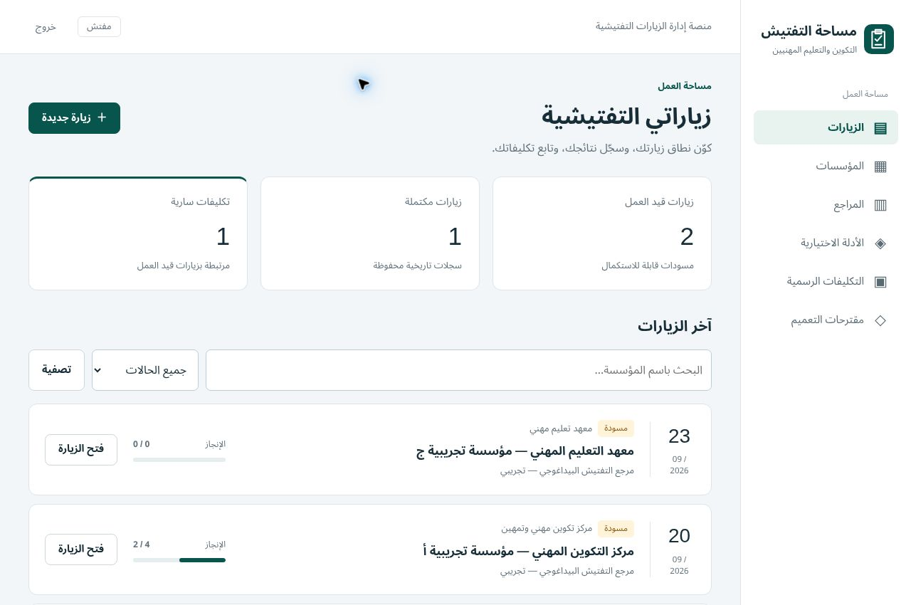

# سجل التحقق — Independent Rebuild

التاريخ: 21/09/2026. المستودع الوحيد المقروء والمعدّل: `scientifica007/Inspector_Website_002`.
الفرع: `build/independent-rebuild`. القبول البشري **Pending**؛ لا يمثل النجاح الآلي اعتمادًا نهائيًا.

## مراحل منشورة

| Commit | النطاق |
|---|---|
| `0586d1cd07c82cea1e84e3fa1ff279f27c64111c` | تأسيس Django ونموذج البيانات وmigration أولية وCI |
| `2cde42ea071b8c4546b33946a0204ca92c240914` | المراجع واللقطات والزيارات والنطاق الانتقائي |
| `4ba34b5635583ac9827d94a15b1cc95c69a33432` | الأدلة والتكليفات والتداخل والإلغاء وحراس التاريخ |
| `c232e86ae2b80b9955c3fe9c032bfcd5d86674ea` | الواجهة العربية وبيانات التجربة واختبارات HTTP |

قراءة GitHub الفعلية لـCI عند `c232e86`: وظيفتا SQLite وPostgreSQL ناجحتان، وتشملان 56 اختبارًا.
[تشغيل GitHub Actions المثبت](https://github.com/scientifica007/Inspector_Website_002/actions/runs/35522169812).

## التحقق المحلي الحالي

- `python manage.py migrate --noinput`: لا migrations معلقة بعد تطبيق 0001 و0002.
- `python manage.py check`: لا مشكلات.
- `python manage.py makemigrations --check --dry-run`: لا تغييرات غير مسجلة.
- `python manage.py test --verbosity 1`: **58 اختبارًا، PASS**.
- أضيف اختبار دخول فعلي بكلمة مرور صحيحة/خاطئة وخروج POST، واختبار إنشاء حساب مفتش دون صلاحيات إدارية،
  ورفض كلمة المرور الضعيفة والحفاظ على الحساب الموجود.

| المجال | الدليل الآلي |
|---|---|
| المصادقة والصلاحيات | رفض المجهول، عزل المالك، منع روابط/طلبات الإدارة، POST وCSRF، إخفاء مسودات التكليف |
| المراجع والحوكمة | إنشاء/تحرير/حذف، شجرة سليمة، خصوصية، لقطة إرسال، قبول مستقل ورفض |
| الزيارة والنطاق | لقطة مجمدة، حذف المصدر، نطاق فارغ، بند عميق وسياق، تقدم، استبعاد واسترجاع، محتوى محلي |
| الأدلة | اختيار صريح، أصل محفوظ، تطبيق متكرر، تغيير/حذف المصدر، أهداف أحدث من اللقطة |
| التكليفات | مرحلتان، هدف فاسد وإصدار ذري، توسيع الفرع، منع تجاوز القفل عبر الأسلاف |
| التداخل والإلغاء | قيود مستقلة، baseline، شرط غير مقفل، سبب إلغاء وسجل محفوظ |
| التاريخ والتصدير | منع الإكمال الناقص، عدم قابلية تعديل المكتمل حتى عبر ORM، تصدير ثابت ومحدد الإصدار |
| التشغيل التجريبي | Seed اختياري ومتكرر يحافظ على كلمات المرور والتعديلات والزيارات |

0002 تثبت triggers ولا تحول بيانات المستخدم. تُنشأ قاعدة اختبار جديدة وتُطبق migrations في كل تشغيل؛
تُختبر الحراس في SQLite وPostgreSQL. لم يُجر اختبار حمل أو اختبار تنافس متعدد العمليات.

## الحاسوب والهاتف — TECHNICAL-PASS

فُحصت استجابات HTML حقيقية مولدة من Django ببيانات تجريبية في Chrome، داخل إطار ذي عرض مضبوط.
هذه أداة فحص تخطيط للقراءة فقط، وليست تطبيقًا بديلًا أو تجاوزًا لتسجيل الدخول. عمليات الكتابة تُختبر عبر HTTP
في test suite؛ لم تُدّعَ جلسة متصفح كاملة تسجل الدخول وتكتب في قاعدة الإنتاج.

| الشاشة | عرض الإطار | clientWidth / scrollWidth | النتيجة |
|---|---:|---:|---|
| لوحة الزيارات | 1280 | 1280 / 1280 | RTL، لا تجاوز أفقي |
| تنفيذ الزيارة | 360 | 345 / 345 | RTL، أزرار 44px، خيارات النتائج قرابة 49px |
| نطاق الزيارة | 360 | 345 / 345 | RTL، حالة العنصر وأصله وقيده ظاهرة |
| أدلة الزيارة | 360 | 345 / 345 | RTL، الاقتراح موضح بأنه اختياري |
| تكليفات الزيارة | 360 | 345 / 345 | RTL، التكليف الرسمي ظاهر |
| إنشاء زيارة | 360 | 345 / 345 | النموذج داخل عرض الهاتف |
| إنشاء تكليف إداري | 360 | 345 / 345 | علمان مستقلان لكل هدف دون تجاوز |
| إنشاء دليل | 360 | 345 / 345 | الأهداف والنموذج داخل العرض |

الفارق 15px في الهاتف هو شريط التمرير الرأسي للإطار. فُتح التنقل المنسدل وأُغلق، وظهرت مساحات العمل دون تجاوز.
تبويبات الزيارة تتحول إلى صفين. العربية والنتيجتان «غير مطابق» و«غير منطبق» منفصلتان بوضوح.
أداة WebMCP الاختيارية للقراءة لا يعتمد عليها التطبيق؛ modelContext غير متاح في متصفح التحقق، فلم يثبت تشغيلها.

[لقطة تنفيذ الزيارة بعرض الهاتف](evidence/mobile-execution.jpg).

## البوابات المتبقية عند تسجيل هذه المرحلة

إعادة التشغيل من clean clone، وقراءة CI للـcommit الذي يتضمن التوثيق وأمر إنشاء المفتش، وإنشاء Draft PR.
تُحدّث نتائج هذه البوابات بعد التنفيذ الفعلي. اختبار المستخدم وفق [HUMAN_ACCEPTANCE.md](HUMAN_ACCEPTANCE.md) ما يزال Pending.
